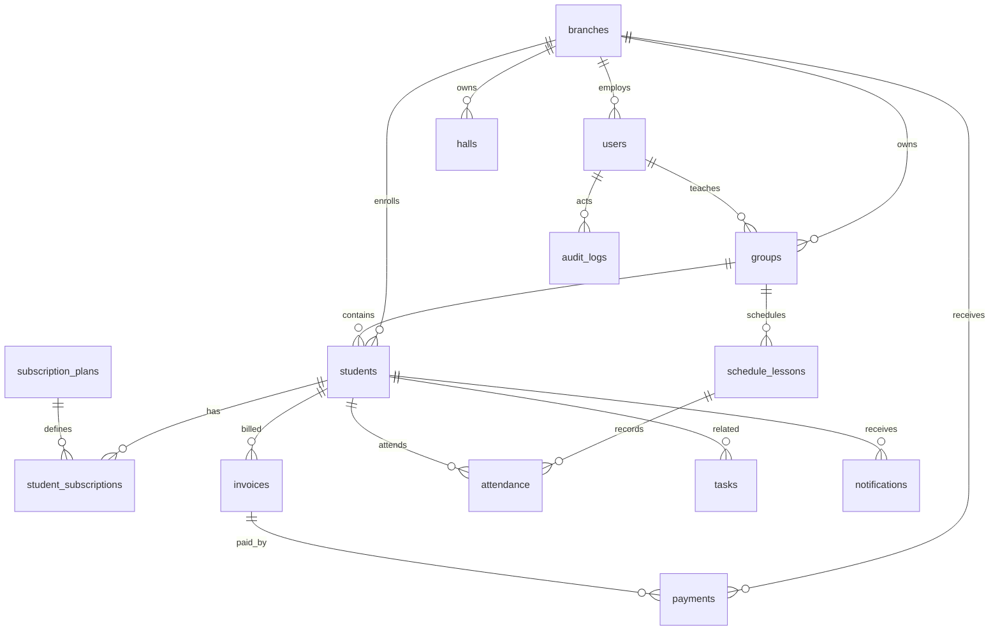

# Эхо Гор 1.0: MVP Структура БД

Документ описывает только MVP-ядро CRM. В схему не входят AI, достижения, геймификация и родительский кабинет.

## Роли Пользователей

| Роль | Код | Основной доступ |
| --- | --- | --- |
| Владелец сети | `owner` | Вся сеть, все филиалы, финансы, отчеты, настройки. |
| Руководитель филиала | `branch_manager` | Только свой филиал: ученики, группы, сотрудники, финансы, расписание. |
| Администратор | `admin` | Операционная работа своего филиала: ученики, счета, посещения, задачи, рассылки. |
| Преподаватель | `teacher` | Свои группы, занятия, посещаемость, базовые данные учеников. |

В MVP нет отдельных учетных записей родителя и ученика.

## Таблицы MVP

### `branches`

Филиалы сети.

Обязательные поля: `id`, `name`, `city`, `address`, `status`, `created_at`, `updated_at`.

Связи:

- `manager_id` -> `users.id`
- один филиал имеет много `users`, `halls`, `groups`, `students`, `schedule_lessons`, `payments`, `invoices`

Индексы: `status`.

### `users`

Сотрудники и системные пользователи.

Обязательные поля: `id`, `role`, `full_name`, `email`, `password_hash`, `status`, `created_at`, `updated_at`.

Связи:

- `branch_id` -> `branches.id`
- пользователь может быть преподавателем в `groups.teacher_id`
- пользователь может создавать счета, платежи, занятия, задачи, рассылки

Индексы: `role`, `branch_id`, `status`, уникальный `email`.

### `halls`

Залы внутри филиалов.

Обязательные поля: `id`, `branch_id`, `name`, `capacity`, `status`, `created_at`, `updated_at`.

Связи:

- `branch_id` -> `branches.id`
- зал используется в группах и занятиях

Индексы: `branch_id`, уникальная пара `branch_id + name`.

### `lead_sources`

Источники заявок: Instagram, рекомендации, сайт, звонок и т.д.

Обязательные поля: `id`, `name`, `status`, `created_at`, `updated_at`.

Связи:

- источник может быть указан у ученика

Индексы: уникальный `name`.

### `groups`

Учебные группы.

Обязательные поля: `id`, `branch_id`, `name`, `capacity`, `status`, `created_at`, `updated_at`.

Связи:

- `branch_id` -> `branches.id`
- `hall_id` -> `halls.id`
- `teacher_id` -> `users.id`
- группа имеет много учеников и занятий

Индексы: `branch_id`, `teacher_id`, `status`, уникальная пара `branch_id + name`.

### `students`

Карточка ученика/посетителя.

Обязательные поля: `id`, `branch_id`, `last_name`, `first_name`, `status`, `created_at`, `updated_at`.

Основные поля: ФИО, дата рождения, телефон, email, родитель, телефон родителя, филиал, группа, источник, статус, справка, страховка, комментарий.

Связи:

- `branch_id` -> `branches.id`
- `group_id` -> `groups.id`
- `source_id` -> `lead_sources.id`
- ученик имеет абонементы, счета, платежи, посещения, задачи, рассылки

Индексы: `branch_id`, `group_id`, `source_id`, `status`, `phone`, `parent_phone`, составной индекс ФИО.

### `subscription_plans`

Справочник абонементов.

Обязательные поля: `id`, `name`, `lessons_count`, `duration_days`, `price`, `status`, `created_at`, `updated_at`.

Связи:

- используется в `student_subscriptions.plan_id`

Индексы: уникальный `name`.

### `student_subscriptions`

Абонементы, купленные учениками.

Обязательные поля: `id`, `student_id`, `plan_id`, `branch_id`, `starts_on`, `ends_on`, `lessons_total`, `lessons_left`, `price`, `discount_amount`, `status`, `created_at`, `updated_at`.

Связи:

- `student_id` -> `students.id`
- `plan_id` -> `subscription_plans.id`
- `branch_id` -> `branches.id`
- `group_id` -> `groups.id`

Индексы: `student_id`, `branch_id`, `group_id`, `status`, `ends_on`.

### `invoices`

Счета к оплате.

Обязательные поля: `id`, `student_id`, `branch_id`, `number`, `amount`, `status`, `issued_at`, `created_at`, `updated_at`.

Связи:

- `student_id` -> `students.id`
- `subscription_id` -> `student_subscriptions.id`
- `branch_id` -> `branches.id`
- `created_by` -> `users.id`

Индексы: `student_id`, `branch_id`, `status`, `due_on`, уникальный `number`.

### `payments`

Платежи и касса филиала.

Обязательные поля: `id`, `branch_id`, `student_id`, `amount`, `method`, `status`, `paid_at`, `created_at`, `updated_at`.

Связи:

- `branch_id` -> `branches.id`
- `student_id` -> `students.id`
- `invoice_id` -> `invoices.id`
- `created_by` -> `users.id`

Индексы: `branch_id + paid_at`, `student_id`, `invoice_id`, `status`.

### `schedule_lessons`

Расписание занятий.

Обязательные поля: `id`, `branch_id`, `group_id`, `starts_at`, `ends_at`, `status`, `created_at`, `updated_at`.

Связи:

- `branch_id` -> `branches.id`
- `group_id` -> `groups.id`
- `teacher_id` -> `users.id`
- `hall_id` -> `halls.id`
- занятие имеет много записей посещаемости

Индексы: `branch_id + starts_at`, `group_id + starts_at`, `teacher_id + starts_at`, `status`.

### `attendance`

Посещаемость учеников.

Обязательные поля: `id`, `lesson_id`, `student_id`, `status`, `created_at`, `updated_at`.

Связи:

- `lesson_id` -> `schedule_lessons.id`
- `student_id` -> `students.id`
- `subscription_id` -> `student_subscriptions.id`
- `marked_by` -> `users.id`

Индексы: `lesson_id`, `student_id`, `status`, уникальная пара `lesson_id + student_id`.

### `tasks`

Операционные задачи по филиалу или ученику.

Обязательные поля: `id`, `title`, `status`, `priority`, `created_at`, `updated_at`.

Связи:

- `branch_id` -> `branches.id`
- `student_id` -> `students.id`
- `assigned_to` -> `users.id`
- `created_by` -> `users.id`

Индексы: `branch_id`, `student_id`, `assigned_to`, `status + due_at`.

### `notifications`

История и очередь сообщений.

Обязательные поля: `id`, `channel`, `recipient`, `body`, `status`, `created_at`, `updated_at`.

Связи:

- `branch_id` -> `branches.id`
- `student_id` -> `students.id`
- `created_by` -> `users.id`

Индексы: `branch_id`, `student_id`, `status`, `scheduled_at`.

### `audit_logs`

Журнал действий пользователей.

Обязательные поля: `id`, `entity_type`, `action`, `created_at`.

Связи:

- `actor_id` -> `users.id`
- `branch_id` -> `branches.id`

Индексы: `actor_id`, `branch_id`, `entity_type + entity_id`, `created_at`.

## Главные Связи

## RBAC MVP

| Возможность | Owner | Branch manager | Admin | Teacher |
| --- | --- | --- | --- | --- |
| Видеть всю сеть | Да | Нет | Нет | Нет |
| Управлять филиалами | Да | Нет | Нет | Нет |
| Управлять своим филиалом | Да | Да | Частично | Нет |
| Управлять сотрудниками | Да | Свой филиал | Нет | Нет |
| Управлять группами | Да | Свой филиал | Свой филиал | Только читать свои |
| Управлять учениками | Да | Свой филиал | Свой филиал | Только свои группы |
| Управлять расписанием | Да | Свой филиал | Свой филиал | Только свои занятия |
| Отмечать посещаемость | Да | Да | Да | Только свои занятия |
| Создавать счета | Да | Да | Да | Нет |
| Принимать оплаты | Да | Да | Да | Нет |
| Смотреть финансы | Все | Свой филиал | Свой филиал | Нет |
| Создавать задачи | Да | Свой филиал | Свой филиал | Ограниченно |
| Отправлять сообщения | Да | Свой филиал | Свой филиал | Только свои группы при разрешении |
| Смотреть аудит | Да | Свой филиал | Нет | Нет |
